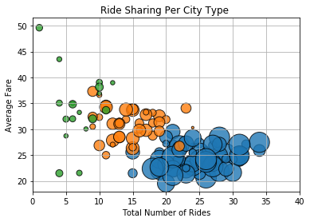
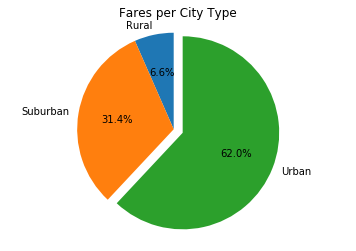
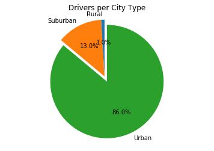
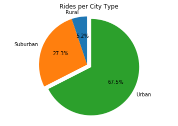

```python
import pandas as pd
import numpy
import matplotlib.pyplot as plt
import csv
import seaborn
```


```python
# Read csv
city_df = pd.read_csv ("raw-data/city_data.csv")
ride_df= pd.read_csv("raw-data/ride_data.csv")

#merge the two data sets
pyber_df = city_df.merge(ride_df, on = "city", how = 'outer') 
pyber_df.head()
```


<div>
<style>
    .dataframe thead tr:only-child th {
        text-align: right;
    }

    .dataframe thead th {
        text-align: left;
    }

    .dataframe tbody tr th {
        vertical-align: top;
    }
</style>
<table border="1" class="dataframe">
  <thead>
    <tr style="text-align: right;">
      <th></th>
      <th>city</th>
      <th>driver_count</th>
      <th>type</th>
      <th>date</th>
      <th>fare</th>
      <th>ride_id</th>
    </tr>
  </thead>
  <tbody>
    <tr>
      <th>0</th>
      <td>Kelseyland</td>
      <td>63</td>
      <td>Urban</td>
      <td>8/19/16 4:27</td>
      <td>5.51</td>
      <td>6.246010e+12</td>
    </tr>
    <tr>
      <th>1</th>
      <td>Kelseyland</td>
      <td>63</td>
      <td>Urban</td>
      <td>4/17/16 6:59</td>
      <td>5.54</td>
      <td>7.466470e+12</td>
    </tr>
    <tr>
      <th>2</th>
      <td>Kelseyland</td>
      <td>63</td>
      <td>Urban</td>
      <td>5/4/16 15:06</td>
      <td>30.54</td>
      <td>2.140500e+12</td>
    </tr>
    <tr>
      <th>3</th>
      <td>Kelseyland</td>
      <td>63</td>
      <td>Urban</td>
      <td>1/25/16 20:44</td>
      <td>12.08</td>
      <td>1.896990e+12</td>
    </tr>
    <tr>
      <th>4</th>
      <td>Kelseyland</td>
      <td>63</td>
      <td>Urban</td>
      <td>8/9/16 18:19</td>
      <td>17.91</td>
      <td>8.784210e+12</td>
    </tr>
  </tbody>
</table>
</div>


```python
#create variables for city type
urban = pyber_df[pyber_df["type"]=="Urban"]
suburban = pyber_df[pyber_df["type"]=="Suburban"]
rural = pyber_df[pyber_df["type"]=="Rural"]

#averages and totals
urban_ridecount = urban.groupby(["city"]).count()["ride_id"]
urban_avgfare = urban.groupby(["city"]).mean()["fare"]
urban_drivecount = urban.groupby(["city"]).mean()["driver_count"]

suburban_ridecount = suburban.groupby(["city"]).count()["ride_id"]
suburban_avgfare = suburban.groupby(["city"]).mean()["fare"]
suburban_drivecount = suburban.groupby(["city"]).mean()["driver_count"]

rural_ridecount = rural.groupby(["city"]).count()["ride_id"]
rural_avgfare = rural.groupby(["city"]).mean()["fare"]
rural_drivecount = rural.groupby(["city"]).mean()["driver_count"]

```

# Bubble Plot


```python
plt.scatter(urban_ridecount, 
            urban_avgfare, 
            s=10*urban_drivecount,
            edgecolor="black", linewidths=1, marker="o",
            alpha=0.8, label="Urban")

plt.scatter(suburban_ridecount, 
            suburban_avgfare, 
            s=10*suburban_drivecount,
            edgecolor="black", linewidths=1, marker="o",
            alpha=0.8, label="Suburban")

plt.scatter(rural_ridecount, 
            rural_avgfare, 
            s=10*rural_drivecount,
            edgecolor="black", linewidths=1, marker="o",
            alpha=0.8, label="Rural")

plt.title("Ride Sharing Per City Type ")
plt.ylabel("Average Fare")
plt.xlabel("Total Number of Rides")
plt.xlim((0,40))
plt.grid(True)


plt.show()
```





```python
#create new dataframe with needed information for fare % by region
type_fare = pyber_df.groupby('type')["fare"].sum().reset_index()
type_fare
```


<div>
<style>
    .dataframe thead tr:only-child th {
        text-align: right;
    }

    .dataframe thead th {
        text-align: left;
    }

    .dataframe tbody tr th {
        vertical-align: top;
    }
</style>
<table border="1" class="dataframe">
  <thead>
    <tr style="text-align: right;">
      <th></th>
      <th>type</th>
      <th>fare</th>
    </tr>
  </thead>
  <tbody>
    <tr>
      <th>0</th>
      <td>Rural</td>
      <td>4255.09</td>
    </tr>
    <tr>
      <th>1</th>
      <td>Suburban</td>
      <td>20335.69</td>
    </tr>
    <tr>
      <th>2</th>
      <td>Urban</td>
      <td>40078.34</td>
    </tr>
  </tbody>
</table>
</div>


# Pie Chart- Fares per city type


```python
#create pie chart for fares by city type
fig1, ax1 = plt.subplots()
ax1.pie(type_fare["fare"], labels = type_fare["type"],explode = (0,0,0.1), 
        startangle=90, autopct = "%1.1f%%",)
ax1.axis('equal')
plt.title('Fares per City Type', fontsize = 12).axes.get_yaxis().set_visible(False)
plt.show()
```





```python
#create dataframe to sum the drivers
type_driver = pyber_df.groupby('type')["driver_count"].sum().reset_index()
type_driver
```


<div>
<style>
    .dataframe thead tr:only-child th {
        text-align: right;
    }

    .dataframe thead th {
        text-align: left;
    }

    .dataframe tbody tr th {
        vertical-align: top;
    }
</style>
<table border="1" class="dataframe">
  <thead>
    <tr style="text-align: right;">
      <th></th>
      <th>type</th>
      <th>driver_count</th>
    </tr>
  </thead>
  <tbody>
    <tr>
      <th>0</th>
      <td>Rural</td>
      <td>727</td>
    </tr>
    <tr>
      <th>1</th>
      <td>Suburban</td>
      <td>9730</td>
    </tr>
    <tr>
      <th>2</th>
      <td>Urban</td>
      <td>64501</td>
    </tr>
  </tbody>
</table>
</div>


# Pie Chart- Drivers per city type


```python
fig1, ax1 = plt.subplots()
ax1.pie(type_driver["driver_count"], labels = type_driver["type"],explode = (0,0,0.1), 
        startangle=90, autopct = "%1.1f%%")
ax1.axis('equal')
plt.title('Drivers per City Type', fontsize = 12).axes.get_yaxis().set_visible(False)
plt.show()
```





# Pie Chart- Rides per city type


```python
type_rides = pyber_df.groupby('type')["ride_id"].count().reset_index()
type_rides
```


<div>
<style>
    .dataframe thead tr:only-child th {
        text-align: right;
    }

    .dataframe thead th {
        text-align: left;
    }

    .dataframe tbody tr th {
        vertical-align: top;
    }
</style>
<table border="1" class="dataframe">
  <thead>
    <tr style="text-align: right;">
      <th></th>
      <th>type</th>
      <th>ride_id</th>
    </tr>
  </thead>
  <tbody>
    <tr>
      <th>0</th>
      <td>Rural</td>
      <td>125</td>
    </tr>
    <tr>
      <th>1</th>
      <td>Suburban</td>
      <td>657</td>
    </tr>
    <tr>
      <th>2</th>
      <td>Urban</td>
      <td>1625</td>
    </tr>
  </tbody>
</table>
</div>


```python
fig1, ax1 = plt.subplots()
ax1.pie(type_rides["ride_id"], labels = type_rides["type"],explode = (0,0,0.1), 
        startangle=90, autopct = "%1.1f%%")
ax1.axis('equal')
plt.title('Rides per City Type', fontsize = 12).axes.get_yaxis().set_visible(False)
plt.show()
```




